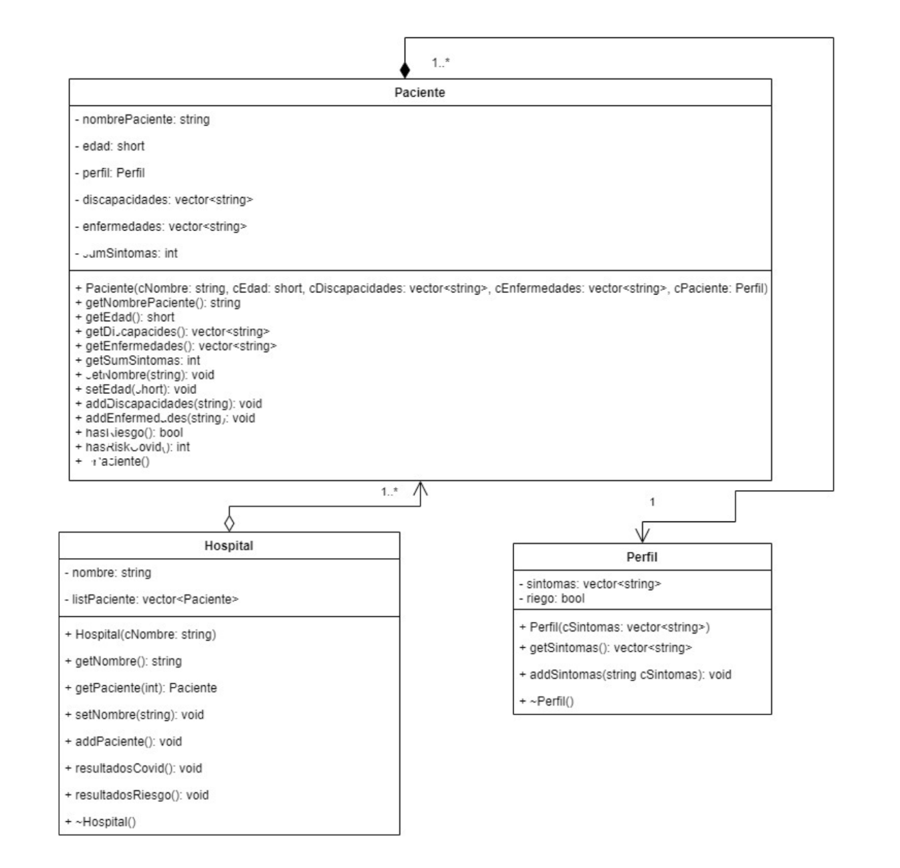

#  TC1003
## Final Project, Object Oriented Computational Thinking, ITESM.

This project is the mockup of what a real hospital database system would look like. In this case, you can add patients and based on the data you input, the program will tell you if the patient is in a critical state or not, or if the patient has symptoms related to COVID-19. All of these results stored in both text files called `riesgo.txt` and `covid.txt`, respectively. 

To run this project, please use `g++ o <name> main.cpp` and `./<name>`. 

## Project Proposal

The project proposal is an interactive platform focused on the health industry in which the users can add the data of the user to the system and this will decide, based on a series of parameters and criteria, if the person could be considered to be "on risk" or if it has symptoms related to COVID-19. When detecting any of these , the system adds its name onto a database (in this case, a text file) which will later then read and print those same names.

## Functionality

The two main functions of the project are as follow:

1. Obtain the numbers of the people considered 'on risk'.
2. Obtain the name of the people with symptoms related to COVID-19.

We also added some extra functions that allow to add diseases to the user, as well as disabilities and symptoms to help the system detect with better precision one of the two results. 

## Expected Result 

We want to create a system that allows not only use its functionalities, but also in a way that, structurally speaking, allows for the user to add even more criteria and functionalities within the system itself. We look for a modularized system that divides its functionalities within the different methods of the class. 

## UML Diagram 

